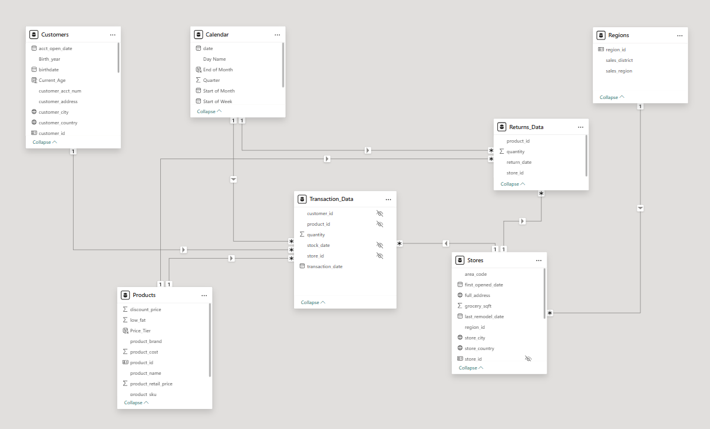
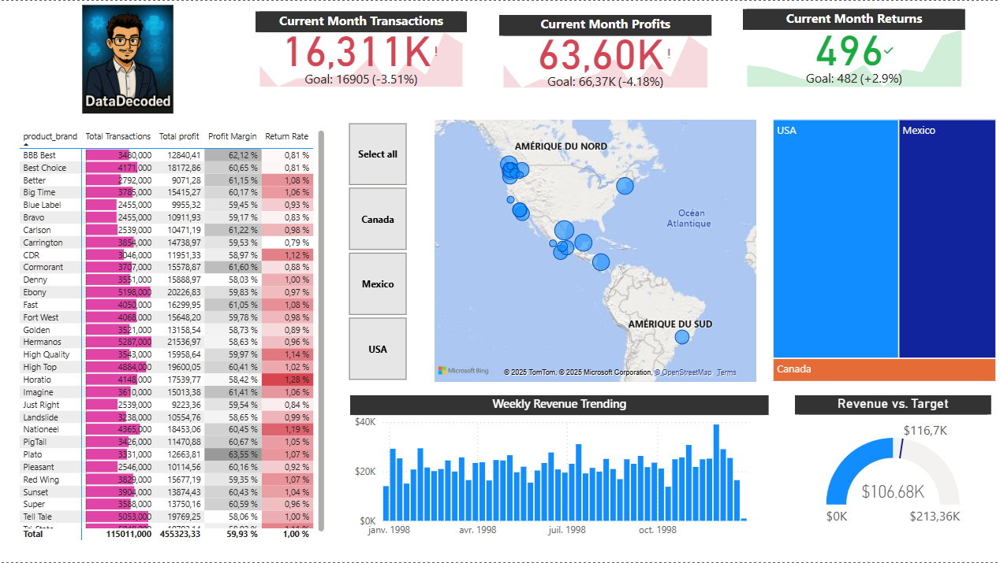

# Market Report Analysis using Power BI

Maven Market is a business intelligence project for a multinational grocery chain operating in Canada, Mexico, and the U.S. The project covers the full BI workflow: data preparation, relational modeling, calculated fields, and interactive report design.

- **ETL techniques** (Extract, Transform, Load)
- Creating a **relational data model**
- Defining **table relationships**
- Writing custom **DAX measures**
- Designing a **dynamic and interactive dashboard**

## 🎯 Project Objectives

- ✅ Connect and transform raw data using Power Query
- ✅ Build a relational data model with well-structured tables
- ✅ Create calculated columns and measures using DAX
- ✅ Track key KPIs such as **current month trasaction**, **Current Month Profit**, and **Current Month Returns**
- ✅ Design an interactive dashboard to visualize key metrics

---

> 💡 This project simulates a real-world scenario.

## 🗂️ Data Structure Overview

The image below shows the **data model**, also referred to as a **normalized schema**.

**Normalization** is the process of organizing tables and columns in a relational database to reduce data redundancy and improve data integrity.

In general, a data model consists of two main types of tables:

- **Fact Table**: Contains measurable metrics or quantitative data.
  - In our case: `Transaction_Data` is the **fact table**.

- **Dimension Tables**: Contain descriptive attributes related to the fact data.
  - In our case:
    - `Regions`
    - `Customer`
    - `Product`
    - `Calendar`

These dimension tables are connected to the fact table through **relationships**, forming a **star schema** structure that supports efficient slicing and dicing of data.

## 🗂️  Project Structure

## Dashboard Preview

---

## 📽️ Demo Video

## 📄 Report

👉 [Click here to view the full report (PDF)](Reports/Market_Report.pdf)

---

## 🙋‍♂️ About Me

**Mohammed Ayoub Essbai**

Data Analyst | Power BI Enthusiast | Python Developer

🔗 [LinkedIn](https://www.linkedin.com/in/mohammed-ayoub-essbai/)

💻 [GitHub](https://github.com/ayoub22222222)

---

## 📜 License

This project is licensed under the MIT License.

